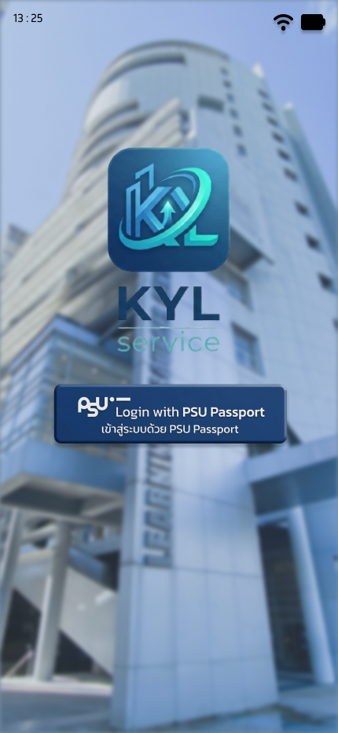
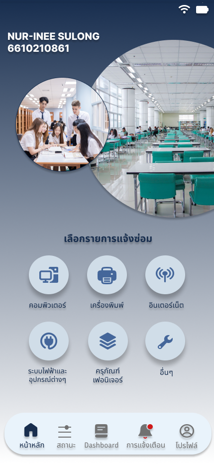
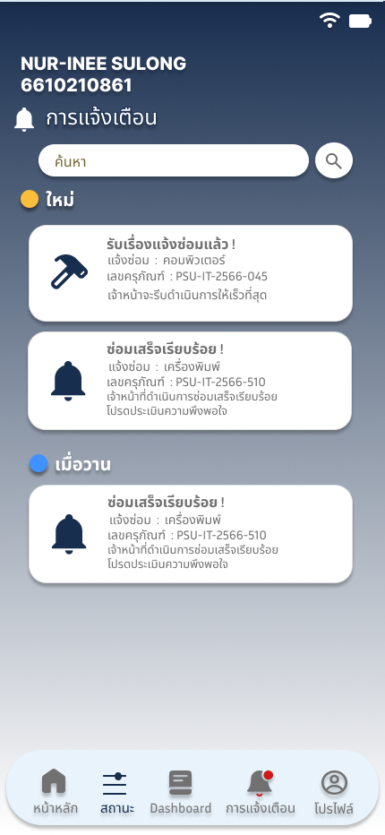
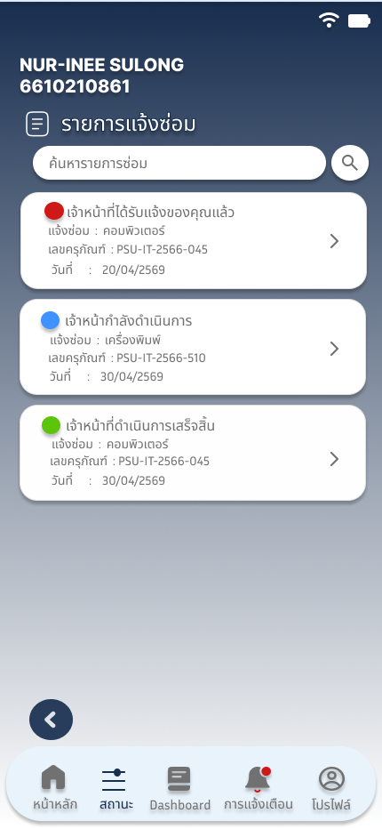
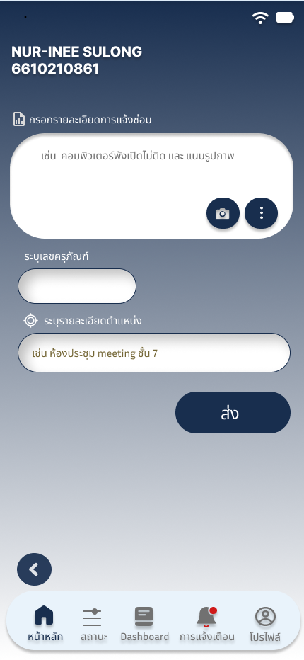
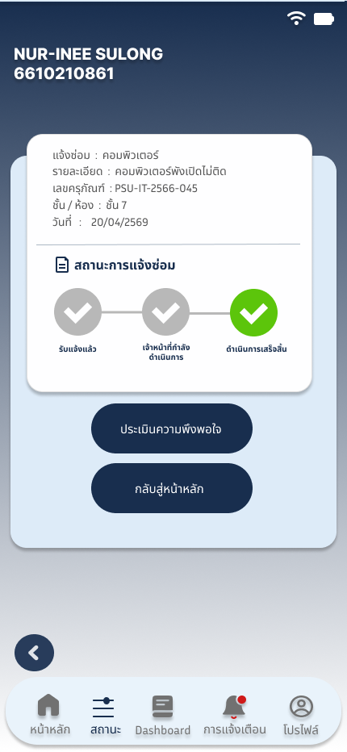
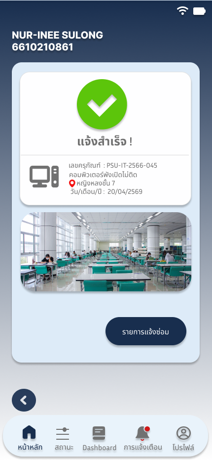
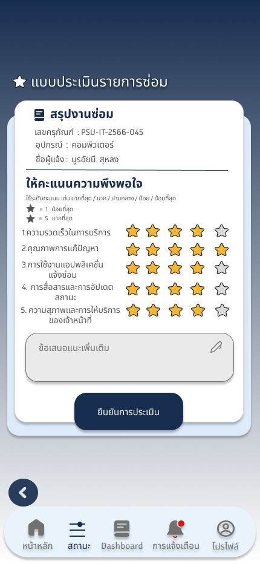
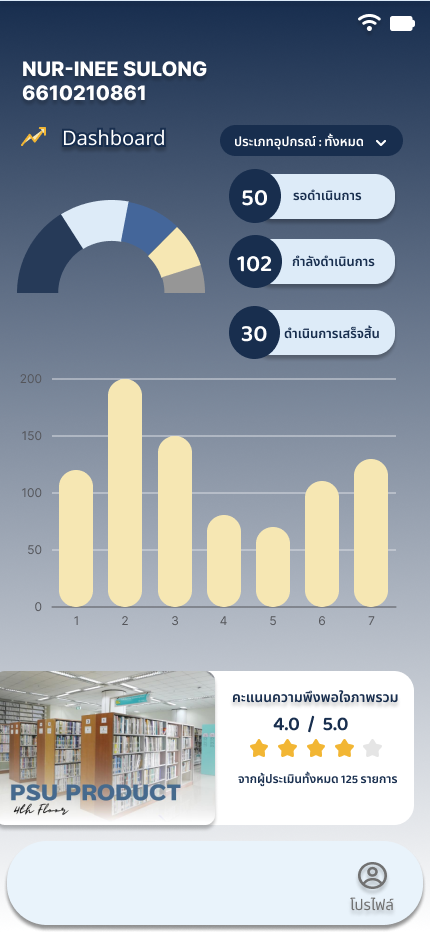

# 📱 UI/UX Design Showcase - Maintenance Request System

## 📸 Screen Showcase

### 1. User Profile

### 4. Repair Process

### 3. Notification & Lists

### 5. Details & Status

### 6. Evaluation Form

# 📱 UI/UX Design Showcase - Maintenance Request System

### 6. Main Dashboard

> 🎨 **Interactive Prototype:** [👉 คลิกที่นี่เพื่อทดลองใช้งานบน Figma](https://www.figma.com/proto/uem0SthBtqCS3xat1DsyKp/Untitled?node-id=15-119&p=f&t=YVdemuZk4eUUuXi5-1&scaling=scale-down&content-scaling=fixed&page-id=0%3A1&starting-point-node-id=1%3A2)

---

